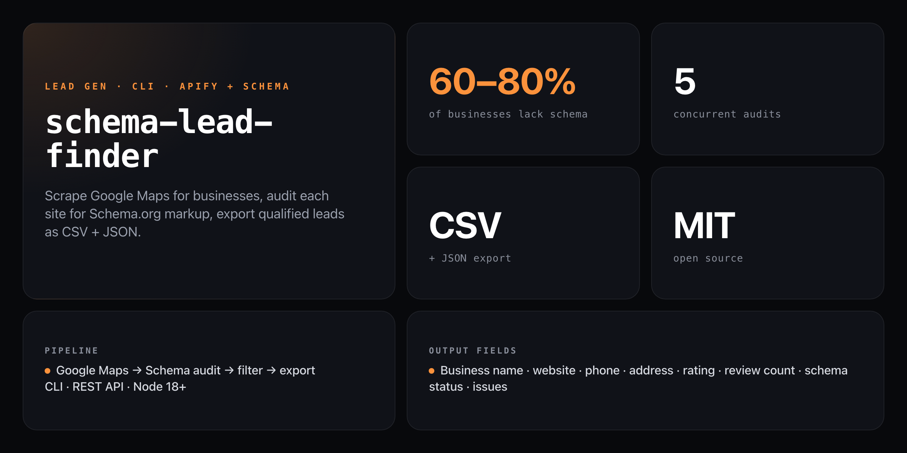

<div align="center">

**Find the businesses that need your SEO services before you pick up the phone.**


</div>

---

60–80% of local businesses have no Schema.org markup. `schema-lead-finder` automates the prospecting pipeline: scrape Google Maps for any niche and city via Apify, audit every website for structured data, filter for the ones with missing or broken schema, and export a ranked lead list — sorted by review count so the highest-value prospects land at the top.

```
═══════════════════════════════════════════════════════
  SCHEMA-MISSING BUSINESS FINDER
═══════════════════════════════════════════════════════
  Niche:    dentist
  Location: chicago
  Limit:    100 businesses
═══════════════════════════════════════════════════════

🔍 Scraping Google Maps for "dentist" in "chicago"...
✅ Found 94 businesses

🔬 Auditing 94 websites for schema markup...
   Progress: 94/94 (100%)
✅ Schema audits complete

📊 Results:
   Total businesses:       94
   Missing/broken schema:  71 (76%)

📁 Output saved to:
   output/leads-dentist-chicago-2026-06-18.csv
   output/leads-dentist-chicago-2026-06-18.json

✅ Pipeline complete!

💰 71 qualified leads ready for outreach
```

## Install

No npm account needed — runs straight from GitHub:

```bash
npx github:NickCirv/schema-lead-finder
```

Requires an `APIFY_TOKEN` environment variable for the Google Maps scraper.

## Usage

```bash
# Basic: niche + location, up to 100 businesses
node src/index.js "dentist" "chicago"

# Custom limit
node src/index.js "plumber" "austin" --limit 50

# Run the REST API server (port 3002)
node src/server.js
```

| Argument / Flag | Description |
|----------------|-------------|
| `<niche>` | Business type to search (e.g. `"dentist"`, `"plumber"`) |
| `<location>` | City or region (e.g. `"chicago"`, `"austin tx"`) |
| `--limit <N>` | Max businesses to scrape (default: 100) |

### Environment variables

| Variable | Required | Description |
|----------|----------|-------------|
| `APIFY_TOKEN` | Yes | Apify API token for Google Maps Scraper |
| `SCHEMA_AUDIT_API` | No | Override the schema audit endpoint (default: hosted Render instance) |

## How the pipeline works

```
Google Maps (Apify)
  → businesses with websites: name, address, phone, rating, reviews
      ↓
Schema audit API (batch, 5 concurrent)
  → hasSchema, schemaTypes, issues, score
      ↓
Filter: no schema OR score < 50 OR any issues
  → ranked by review count (high-volume businesses first)
      ↓
CSV + JSON export
  → output/leads-<niche>-<location>-<date>.csv / .json
```

## Output fields

| Field | Description |
|-------|-------------|
| `Name` | Business name |
| `Website` | Verified URL |
| `Phone` | Contact number |
| `Address` | Full address |
| `Rating` | Google Maps rating |
| `Reviews` | Review count (used for ranking) |
| `Schema Status` | `NO SCHEMA` or schema types found |
| `Issues` | Audit issues list |

## REST API server

`node src/server.js` starts an Express server on port 3002 with async job processing:

| Endpoint | Method | Description |
|----------|--------|-------------|
| `/api/find-leads` | POST | Start a full lead generation job |
| `/api/find-leads-free` | POST | Free sample (3 leads, rate-limited) |
| `/api/job/:jobId` | GET | Poll job status and progress |
| `/api/job/:jobId/download/:format` | GET | Download `csv` or `json` results |
| `/health` | GET | Health check |

Jobs return immediately with a `jobId`; poll the status endpoint to track scraping → auditing → filtering → report generation.

## What it is NOT

- **Not a real-time monitoring tool.** Run it per-campaign when you need fresh prospecting lists — it is not a continuous watcher.
- **Not a replacement for manual qualification.** The filter catches missing and low-scoring schema; always verify the lead before outreach.
- **Not zero-cost to run.** The Apify Google Maps Scraper has per-place pricing (~$5 per 1,000 places). Budget accordingly.

---

<div align="center">
<sub>Node 18+ · MIT · by <a href="https://github.com/NickCirv">NickCirv</a></sub>
</div>
